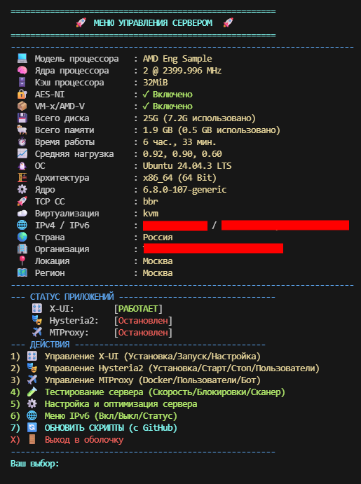
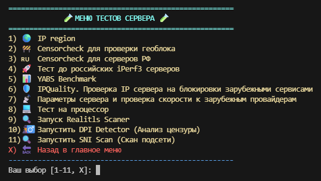
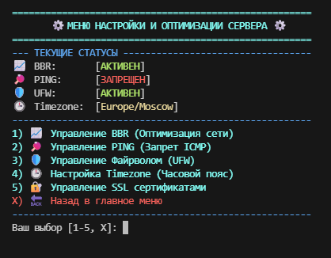

# 🚀 VPS Server Menu

**VPS Server Menu** — это мощный, удобный и полностью интерактивный Bash-скрипт для быстрого управления и настройки вашего VPS/VDS сервера. 

Забудьте о необходимости запоминать десятки длинных команд. Управляйте прокси, сетью, фаерволом и системными тестами прямо из красивого консольного меню!

---

## ✨ Главные возможности

* 📊 **Системный мониторинг:** Отображение нагрузки на процессор (LA), использования оперативной памяти и аптайма сервера прямо на главном экране.
* 🛡️ **Управление прокси:** Установка и управление панелью **X-UI Pro** ([3x-ui-pro](https://github.com/mozaroc/3x-ui-pro)) — VLESS/Reality/Trojan через nginx с автоматическим SSL, Clash-подпиской, диагностикой сети и бэкапом.
* 🌐 **Управление сетью и IPv6:** Безопасное включение/отключение IPv6 на уровне ядра, проверка доступности и назначенных адресов.
* 🔒 **Фаервол и порты:** Быстрое открытие портов (UFW) и управление SSL-сертификатами (Acme.sh).
* 🧪 **Инструменты тестирования (Menu Tests):** Встроенные скрипты для диагностики сети и обхода блокировок:
  * **Censorcheck** встроен локально (а не скачивается заново при каждом запуске) и поддерживает отдельные режимы: проверка геоблока, радар ТСПУ по сетям РФ (с настройкой собственного RIPE Atlas ключа прямо из меню) или полная проверка.
* 🔄 **Умное обновление:** Встроенная функция `git pull` для обновления меню до последней версии в один клик без перезагрузки сервера.
## 🛠 Установка / Обновление
Запустите команду в терминале вашего сервера:
```bash
bash <(curl -sL https://raw.githubusercontent.com/adkudryashov/VPS-main-menu/main/install.sh)
```

## 🗑 Удаление
```bash
bash <(curl -sL https://raw.githubusercontent.com/adkudryashov/VPS-main-menu/main/uninstall.sh)
```
---
## 📸 Скриншоты









## ⚙️ Требования
ОС: Ubuntu 20.04+

Права: root

Установленные пакеты: git, curl (остальные зависимости, такие как Docker или Python, меню установит автоматически при запуске соответствующих тестов).

---

## 🤝 Благодарности и используемые компоненты

Этот проект был бы невозможен без огромного количества замечательных инструментов от Open Source сообщества и поддержки профильных ресурсов. Выражаю огромную благодарность авторам следующих проектов, которые интегрированы в данное меню:

### 📢 Сообщество и идеи
* **[Комьюнити ITDog]** — за предоставленные скрипты проверки, ценные обсуждения, тесты и неоценимый вклад в развитие свободного интернета в РФ. Вы лучшие! 🐕

### 🛡️ Прокси и маршрутизация
* **[3x-ui-pro](https://github.com/mozaroc/3x-ui-pro)** от *mozaroc* — автоматическая установка панели 3x-ui с nginx, SSL, Clash-подпиской и диагностикой сети.
* **[3x-ui](https://github.com/MHSanaei/3x-ui)** от *MHSanaei* — базовая многофункциональная панель управления, на которой построен 3x-ui-pro.

### 🕵️‍♂️ Анализ блокировок и сети
* **[Censorcheck](https://github.com/vernette/censorcheck) & IP Region** от *vernette* — скрипты для проверки геоблоков и определения принадлежности IP. Censorcheck встроен в меню локально (`censorcheck.sh`) с доработками (режимы `--mode`, настройка RIPE Atlas ключа через меню).
* **[RealiTLScanner](https://github.com/XTLS/RealiTLScanner)** от *XTLS* и база **[GeoIP](https://github.com/Loyalsoldier/geoip)** от *Loyalsoldier* — продвинутый сканер для поиска SNI.
* **[DPI Detector](https://github.com/Runnin4ik/dpi-detector)** от *Runnin4ik* — утилита для глубокого анализа цензуры трафика в РФ.
* **[SNI Scan](https://github.com/dewil/sni-scan)** от *dewil* — удобный Python-скрипт для сканирования подсетей на доступность SNI.

### 📊 Бенчмарки и тесты сервера
* **[YABS (Yet Another Bench Script)](https://github.com/masonr/yet-another-bench-script)** от *masonr* — один из лучших комплексных тестов производительности (CPU, RAM, Disk, Network).
* **[bench.sh](https://bench.sh/)** от *teddysun* — классический скрипт для вывода характеристик сервера и проверки скорости сети.
* **[IPQuality](https://github.com/xykt/IPQuality)** от *xykt* — отличный инструмент для проверки IP сервера на блокировки и флаги со стороны зарубежных сервисов.

## 📝 Лицензия
Проект распространяется по лицензии MIT. Вы можете свободно использовать, изменять и распространять этот код.
